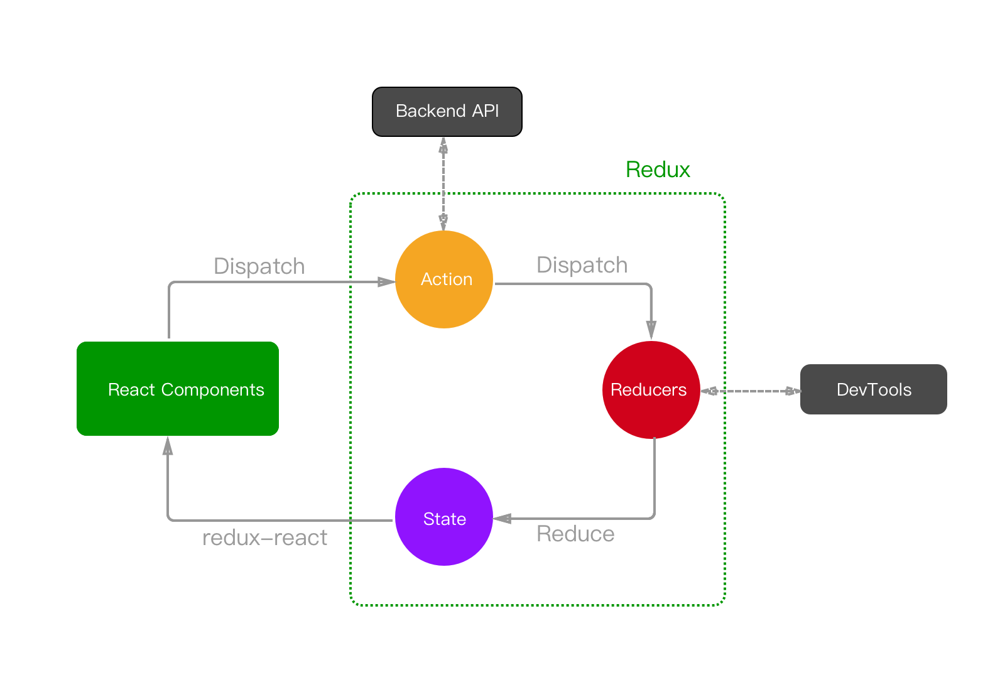

# 单页应用的数据流方案探究

[2017QCon分享](http://ppt.geekbang.org/slide/show/776)

### 组件化

> [MDN的web component定义](https://developer.mozilla.org/en-US/docs/Web/Web_Components)

> 个人理解

一个组件就是一个View(视图)，这个视图包含html，js(自身业务逻辑)，css(私有)。
组件就是将整个页面分割成一个个小的单元，这些单元组成了一个倒立的组件树。
组件之间互不影响，但可以通信，使用一个组件只需要在组件树中添加一个节点，
删掉这个节点也不影响其它组件，从而实现高内聚，低耦合。

> 组件化的实现

* Vue Components
* React Components
* Angular Directives

### Model-Driven-View

> 一个Component就是一个View，View又是由Model驱动的

```
  view = f(state)
```

> 当数据模型产生变化的时候，其对应的视图也会随之变化
```
  view + Δview = f(state + Δstate)
```

> 数据的变化又是由用户动作引起的
```
  Δstate = reducer(action)
```

> 将这些变化的状态和最初的状态叠加起来就是当前的状态，这也是Redux的核心理念

```
  state := reduce(Δstate, initState)
```

数据的变化导致视图变化，怎么收集和组织这些变化数据源呢?

### Reactive Programming

* [RxJS](https://github.com/Reactive-Extensions/RxJS)
* [xstream](https://github.com/staltz/xstream)
* [most](https://github.com/cujojs/most)

> RxJS

* Observable 可观察对象/被观察者：可以是一个数值，事件，总之是可以产生数据的生产者 
* Observer 观察者：回调函数，消费Observable传来的数据
* Subscription 订阅：取消观察者执行
* Operators 操作符：对Observable传来的数据流进行处理，是纯函数
* Subject 主题：等同于EventEmitter
* Schedulers 调度者：调度者控制着何时启动一个订阅和何时通知被发送，setTimeout，requestAnimationFrame

> Observable

* 创建可观察对象
1. Observable.create 内部产生新事件
2. new Rx.Subject() 外部产生新事件
* 转换为可观察对象
1. Observable.of 1个或多个数值
2. Observable.from 数组
3. Observable.fromEvent dom事件
4. Observable.fromPromise Promise
5. Observable.bindCallback 正常回调，第一个参数是结果
6. Observable.bindNodeCallback Node中的回调，第一个参数是Error

### 组件与状态

> 组件间通信


* 父组件通过props传递给子组件
* 子组件通过事件通知父组件
* props可以多级传递

> 存在的问题

* 组件嵌套太深，数据传递繁琐
* 兄弟组件之间如何通信
* 非父子非兄弟的跨分支的组件怎么通信

简单来说就是：
* 多个views依赖同一个state
* 多个views需要修改同一个state

> 解决方案

将 state 外置，统一管理，整个应用的 state 组成一个 store，
所有的组件引用同一个 store，一个 state 变化就通知相应的组件更新

> 组件如何管理状态

* 一切状态内置，组件自己管理自己状态
* 一切状态外置，组件不管理自己状态
* 部分内置，由组件自己管理，另外一些由全局Store管理

它们的差别是：组件究竟是纯展示，还是带一些逻辑。

> 状态完全内置

这种组件一般比较简单，可能只是静态展示（没有状态），如果业务比较复杂，
说明你需要将该组件拆分成多个子组件

> 状态完全外置

React纯展示组件：
```javascript

const Hello = ({name}) => <h1>Hello {name}</h1>

```

Vue纯展示组件：
```javascript

const Hello = {
 functional: true,
 props: ['name'],
 render (h, { props }) {
   return <h1>Hello {props.name}</h1>
 }
}

```

这种组件的优势是，只做展示层，展示层只和输入的数据有关，复杂的业务逻辑交给外部统一处理

> 部分外置

当一个组件业务复杂起来，会有事件，生命周期，如果把一些自身私有的状态外置会有几个问题

* 这样的状态只跟某组件自己有关，放出去到全局Store，会增加Store的不必要的复杂度
* 组件的自身形态状态被外置，将导致组件与状态的距离变远，从而对这些状态的读写变得比原先繁琐
* 带交互的组件，无法独立、完整地描述自身的行为，必须借助外部管理器

> 如何实现将外置的状态和组件结合

在React中是以props传递的，如React + Redux

在Vue中是以计算属性传递的，如Vue + Vuex

### Redux



### Vuex


### MobX


### Vue VS React + MobX
```javascript
// vue
const vm = new Vue({
  data: {
    firstName: 'Foo',
    lastName: 'Bar'
  },
  computed: {
    fullName () {
      return this.firstName + ' ' + this.lastName
    }
  }
})

// mobx
import {observable, computed} from 'mobx'
class Store {
  @observable firstName = 'Foo'
  @observable lastName = 'Bar'

  @computed get fullName() {
    return `${this.firstName} ${this.lastName}
  }
}

const data = new Store()

```

### vue-rx


### MVI架构

> [cycle.js理念](https://cycle.js.org/)

* 一切都是事件源
* 使用Reactive的理念构建程序的骨架
* 使用sink来定义应用的逻辑
* 使用driver来隔离有副作用的行为（网络请求、DOM渲染）

基于这套理念，编写代码的方式可以变得很简洁流畅：
* 从driver中获取action
* 把action映射成数据流
* 处理数据流，并且渲染成界面
* 从界面的事件中，派发action去进行后续事项的处理

```
App := View(Model(Intent({ DOM, Http, WebSocket })))

```

* Intent，负责从外部的输入中，提取出所需信息
* Model，负责从Intent生成视图展示所需的数据
* View，负责根据视图数据渲染视图

