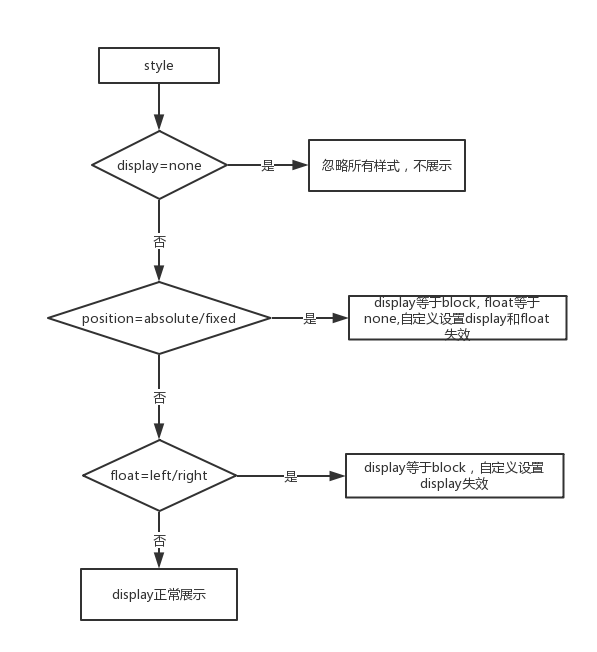

# display，position, float 之间关系的定义

 

inline-block: 行内块元素，拥有盒模型的margin,padding,width,height同时可以在一行显示
    inline-block在正常的文档流中，以高度最大的元素高度为行高，元素之间可能会有空白（font-size:0解决），
    默认是从左到右排列，可以设置父元素的text-align改变排列顺序，可以设置vertical-align垂直对齐
float：浮动会导致元素强制block，脱了文档流，父元素高度塌陷，元素之间没有空白